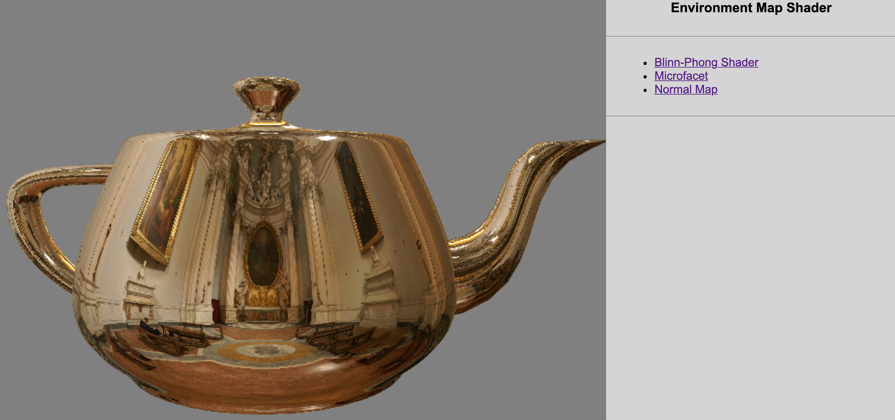
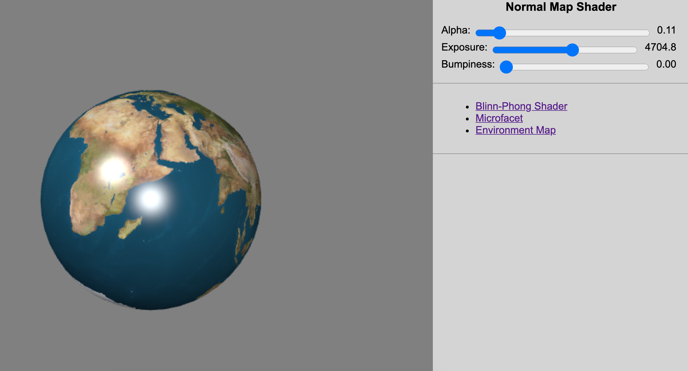
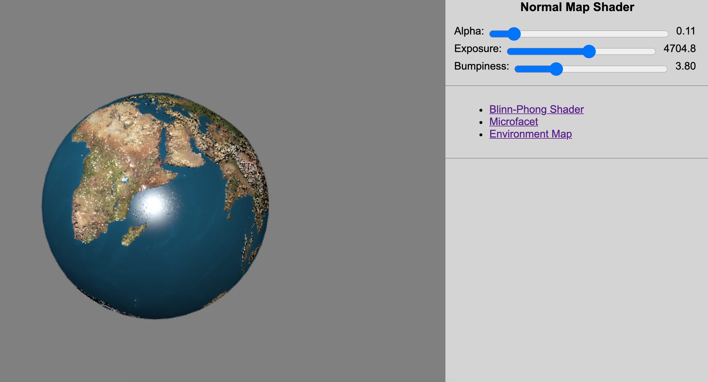

# Shading Techniques

## Overview

This project uses several computer graphics principles to form interactable objects using WebGL.

To run this program, you need to serve the js files, then navigate to the html pages in a browser:

  `python -m http.server 8000`

## Environment Mapping

This example shows how the program is able to map an image to an object. 

The object (teapot) is a reflexion of the image which surrounds the object. 

The teapot is able to move, and the image stays in place, changing the reflexion on the object.

## Microfacet and Blinn-Phong Shaders

These pages are a simple demonstration of the Blinn-Phong and Microfacet shading techniques.

[Blinn-Phong](https://en.wikipedia.org/wiki/Blinn%E2%80%93Phong_reflection_model)

[Microfacet](https://en.wikipedia.org/wiki/Specular_highlight)

## Normal Application

In this example the program reads a heat map of "roughness" and uses that information to generate normals for an object.

Here is the original object, completely smooth:

And here is the same object with the normals adjusted:

